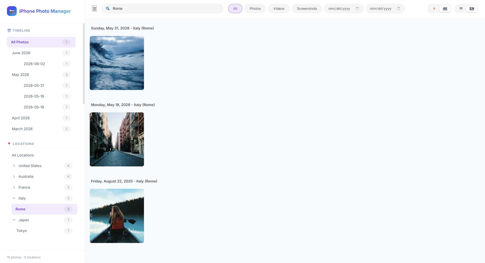
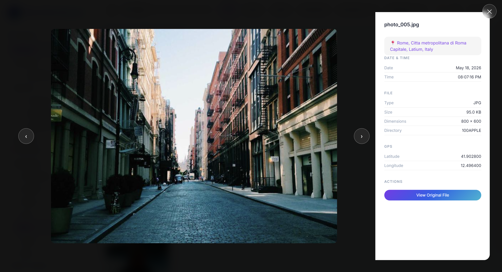

# iPhone Photo Manager

*Read this in other languages: [English](README.md), [中文](README_zh.md).*

This is a lightweight, responsive web application for managing, organizing, and exploring photos and videos exported from iPhone and Android devices. It organizes your media by timeline and automatically groups them by geocoded locations using embedded EXIF data.

## Demo
<p align="center">
  
  <br />
  
</p>
*Demo showcasing timeline scrolling, location filtering, and language switching.*

### ✨ Features

A lightweight, local-first mobile photo gallery. It supports HEIC/HEIF, JPEG, PNG, WebP, AVIF, MOV, MP4, 3GP, iPhone Live Photos, and Android Motion Photos. Embedded Motion Photo video is streamed from the source file without creating a duplicate video.

- **⭐ Interactive Photo Favoriting:** Toggle favorites seamlessly with one click on gallery cards or inside the modal lightbox. Includes real-time bidirectional syncing, a dedicated "⭐ Favorites" filter view, and smooth card exit animations when unfavoriting.
- **Smart Categorization & Bilingual Search:** 5 semantic categories: All, Photos, Videos, Screenshots (with expanded resolution & iOS/Android EXIF/XMP screenshot detection), and ⭐ Favorites. Full bilingual fuzzy search supporting queries in both Chinese and English (e.g. "苏黎世" / "Zurich", "Delft", "北京").
- **Seamless Modal Lightbox Navigation:** Full-screen glassmorphism viewer with navigation buttons, keyboard arrows, mouse wheel, and **mobile touch swipe gestures**. Automatically fetches the next page when reaching the end of loaded photos, with infinite wrap-around support.
- **Immersive Slideshow (Autoplay):** Sit back and enjoy your memories with a highly configurable slideshow. Filter by date, country, and media type, adjust playback speed, and choose whether to play full videos/Live Photos before advancing.
- **Google Photos Takeout metadata:** Imports capture time, GPS, altitude, descriptions, and favorites from adjacent Takeout JSON sidecars, including supplemental-metadata and truncated sidecar filenames.
- **Glassmorphism UI:** A premium, modern interface with smooth micro-animations and beautiful light/dark themes.

To use it, export your iPhone or Android media and copy it into your configured `PHOTOS_DIR` (default is `./photos` in the project root, which you can configure in your `.env` file). The tool will automatically scan the folder on startup.

**Expected Directory Structure:**

```text
iphone-photo-manager/
├── photos/                  # Your PHOTOS_DIR (configured in .env)
│   ├── 202601/              # (Optional) Group by year/month
│   │   ├── IMG_0001.HEIC
│   │   ├── IMG_0001.MOV     # Paired Live Photo video
│   │   └── IMG_0002.JPG
│   └── ...
├── server/                  # Python backend
│   ├── app.py               # FastAPI entrypoint, routing, background tasks
│   ├── database.py          # SQLite database schema and queries
│   ├── scanner.py           # File scanning and EXIF/MOV metadata extraction
│   ├── thumbnail.py         # WebP thumbnail generation
│   └── geocoder.py          # Offline reverse geocoding (reverse_geocoder + pycountry)
├── frontend/                # Vanilla HTML/CSS/JS frontend (No framework)
│   ├── index.html           # Page structure
│   ├── index.css            # Styles (Dark/Light themes, Mobile queries)
│   └── js/                  # JS Modules (Gallery, Lightbox, Virtual scroll, API, etc.)
├── data/                    # Runtime data (auto-generated, gitignored)
│   ├── photos.db            # SQLite database
│   ├── thumbnails/          # Cache for thumbnails and high-res renders
│   └── translation_cache.json # Location translation cache
├── scripts/                 # Management & utility scripts
│   ├── start.sh / start.ps1 # Start server script (Linux/macOS & Windows)
│   └── stop.sh / stop.ps1   # Stop server script (Linux/macOS & Windows)
├── tests/                   # Automated unit and integration test suite
├── .env                     # Environment variables (do not commit)
├── .env.template            # Environment variables template
├── requirements.txt         # Python dependencies
└── ARCHITECTURE.md          # Architecture and design principles
```

### 🚀 Quick Start

#### 1. Requirements
Python 3.10+ and [uv](https://docs.astral.sh/uv/getting-started/installation/) are required.

```bash
# Clone the repository
git clone <repo-url>
cd iphone-photo-manager

# Create a virtual environment and install dependencies
uv venv --python 3.10
uv pip install -r requirements.txt
```

#### 2. Configuration

```bash
# macOS/Linux
cp .env.template .env

# Windows (CMD/PowerShell)
copy .env.template .env
```

Key configuration options (`.env`):

| Variable | Default | Description |
|---|---|---|
| `APP_LANGUAGE` | `zh` | UI Language: `zh` (Chinese) or `en` (English) |
| `APP_THEME` | `light` | UI Theme: `light` or `dark` |
| `PHOTOS_DIR` | `photos` | Photo directory path (relative to project root, or absolute) |
| `SERVER_HOST` | `127.0.0.1` | Bind address (use `0.0.0.0` for LAN access) |
| `SERVER_PORT` | `8000` | Server port |
| `SCAN_ON_STARTUP` | `True` | Whether to perform an incremental scan on startup |
| `LOAD_ORIGINAL_ON_CLICK`| `False` | Auto-load 4K high-res image when opening a single photo |
| `DB_PATH` | `data/photos.db` | SQLite database path |
| `THUMBNAIL_DIR` | `data/thumbnails` | Directory for caching thumbnails |

#### 3. Import Photos

Place your iPhone photos into the `photos/` directory, ideally grouped by year/month subfolders.
*(Hint: You can use AirDrop or USB to export directly. The system automatically pairs `.HEIC` and `.MOV` files for Live Photos).*

For a Google Photos Takeout export, extract all archive parts into the same directory tree and set `PHOTOS_DIR` to the extracted `Takeout/Google Photos` directory (or copy that directory under `photos/`). Keep each media file beside its `.json` or `.supplemental-metadata.json` file. The JSON files are not shown as media; their capture time, GPS, altitude, description, and favorite state are applied automatically. Adding, replacing, or removing a sidecar is detected by the next incremental scan.

#### 4. Start the Server

Ensure you are in the project root directory (e.g. `iPhone-Photo-Manager`), then run:

```bash
# Option 1: Direct command
uv run --no-project python -m server.app

# Option 2: Using convenience scripts
# Linux / macOS:
./scripts/start.sh
# Windows PowerShell:
.\scripts\start.ps1
```

On the first launch, the server will automatically:
1. Scan files and extract EXIF metadata.
2. Generate WebP thumbnails in the background.
3. Perform offline reverse geocoding.

Once started, open your browser and navigate to: **http://127.0.0.1:8000**

#### 5. Stop the Server

Press `Ctrl+C` in the terminal where the server is running to stop it.

If running in the background:
```bash
# Linux / macOS:
./scripts/stop.sh

# Windows PowerShell:
.\scripts\stop.ps1
```

### 📖 User Guide
- **Browsing**: Scroll down to load more. Daily headers display your trajectory.
- **Timeline**: Click a month in the sidebar to filter. Click the arrow to expand and filter by a specific day.
- **Locations**: Click a country in the sidebar to view all photos from that country, or expand to select a specific city. The search bar supports bilingual fuzzy searching.
- **High-Res Viewing**: Click a photo to open the modal. Use arrow keys, mouse wheel, on-screen glassmorphism buttons, or **mobile touch swipe** to navigate. Navigation automatically loads subsequent pages when reaching the end. If `LOAD_ORIGINAL_ON_CLICK` is false, click "View Original File" to render and cache the full-quality image.
- **Favorites**: Click the star icon on any card or inside the modal to favorite photos; click "⭐ Favorites" in the header to view your starred collection.
- **Slideshow**: Click the "Slideshow / 幻灯片" button in the top bar to configure and start an automated presentation of your photos and videos. You can also start the slideshow directly from any individual photo's detail view using the inline toggle.
