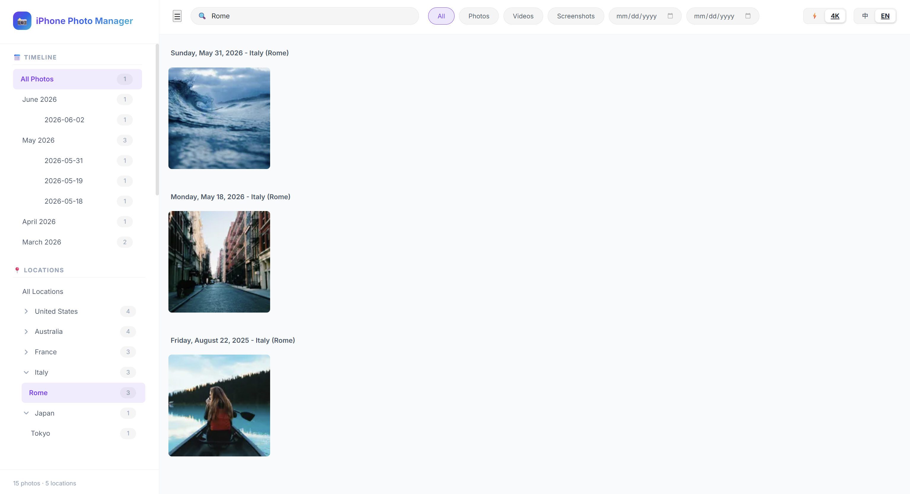
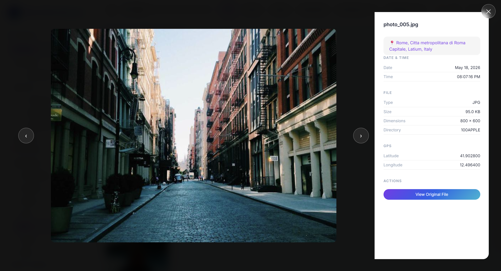

# iPhone Photo Manager

*其他语言版本: [English](README.md), [中文](README_zh.md).*

这是一个轻量级、响应式的网页应用，用于管理、组织和探索你的 iPhone 照片与视频。它能通过时间线进行展示，并利用内嵌的 EXIF 数据自动通过地理位置对媒体进行归类和分组。

## 演示 (Demo)
<p align="center">
  
  
</p>
*演示展示了时间线滚动、地点分类筛选以及中英文切换功能。*

### ✨ 核心功能

一款轻量级、本地优先的 iPhone 照片网页画廊。支持 HEIC、实况照片 (MOV) 和离线反向地理编码，所有数据均在本地处理，绝不上传云端。

使用方法非常简单：只需将 iPhone 相册导出并复制到你指定的 `PHOTOS_DIR` 目录下即可。例如放在当前项目目录的 `./photos` 文件夹下（此路径可在 `.env` 文件中配置）。工具在启动时会自动扫描该目录。

**预期的目录结构：**

```text
iphone-photo-manager/
├── photos/                  # 你的 PHOTOS_DIR 照片目录（在 .env 中配置）
│   ├── 202601/              # （可选）按年月划分子文件夹
│   │   ├── IMG_0001.HEIC
│   │   ├── IMG_0001.MOV     # 对应的实况照片视频
│   │   └── IMG_0002.JPG
│   └── ...
├── server/                  # Python 后端
│   ├── app.py               # FastAPI 主入口，API 路由，后台任务
│   ├── database.py          # SQLite 数据库 schema 与查询
│   ├── scanner.py           # 文件扫描与 EXIF/MOV 元数据提取
│   ├── thumbnail.py         # WebP 缩略图生成（small / medium）
│   └── geocoder.py          # 离线反向地理编码（reverse_geocoder + pycountry）
├── frontend/                # 纯 HTML/CSS/JS 前端（无框架）
│   ├── index.html           # 页面结构
│   ├── index.css            # 样式（深色/浅色主题、移动端媒体查询）
│   └── index.js             # 交互逻辑、Gallery 渲染、Modal、侧边栏
├── photos/                  # 照片存放目录（按 YYYYMM 子文件夹组织）
├── data/                    # 运行时数据（自动生成，已 gitignore）
│   ├── photos.db            # SQLite 数据库
│   └── thumbnails/          # 缩略图及高清渲染缓存
├── .env                     # 环境变量配置（不提交）
├── .env.template            # 环境变量模板
├── requirements.txt         # Python 依赖
├── stop.sh                  # 停止服务脚本
└── ARCHITECTURE_zh.md       # 项目架构与原理说明
```

### 🚀 快速开始

#### 1. 环境准备
需要 Python 3.10+。

```bash
# 克隆项目
git clone <repo-url>
cd iphone-photo-manager

# 安装依赖
pip install -r requirements.txt
```

#### 2. 配置

```bash
# 复制环境变量模板并按需修改
cp .env.template .env
```

主要配置项：

| 变量 | 默认值 | 说明 |
|---|---|---|
| `APP_LANGUAGE` | `zh` | 界面语言：`zh`（中文）或 `en`（英文） |
| `APP_THEME` | `light` | 主题：`light` 或 `dark` |
| `PHOTOS_DIR` | `photos` | 照片目录路径（相对于项目根目录，或绝对路径） |
| `SERVER_HOST` | `127.0.0.1` | 服务绑定地址（设为 `0.0.0.0` 可允许局域网访问） |
| `SERVER_PORT` | `8000` | 服务端口 |
| `SCAN_ON_STARTUP` | `True` | 启动时是否自动执行增量扫描 |
| `LOAD_ORIGINAL_ON_CLICK`| `False` | 打开单张图片时是否直接加载高清原图 |
| `DB_PATH` | `data/photos.db` | SQLite 数据库文件路径 |
| `THUMBNAIL_DIR` | `data/thumbnails` | 缩略图缓存目录 |

#### 3. 导入照片
将 iPhone 照片按年月分子文件夹放入 `photos/` 目录。（支持用 AirDrop 或 USB 直接导出，系统会自动配对 Live Photo）。

#### 4. 启动服务
```bash
PYTHONPATH=. python3 server/app.py
```
启动完成后在浏览器打开：**http://127.0.0.1:8000**

#### 5. 停止服务
```bash
./stop.sh
```

### 📖 使用指南
- **时间筛选**：左侧时间线点击月份快速跳转，点击箭头展开可精确到天。
- **查看原图**：如果 `LOAD_ORIGINAL_ON_CLICK` 为 false，可以在大图预览界面底部点击“查看原图”，系统会自动渲染并缓存一张满画质（4K）的高清大图供你查阅。
